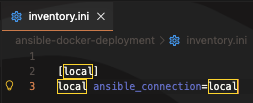
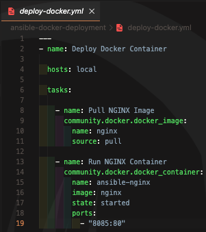
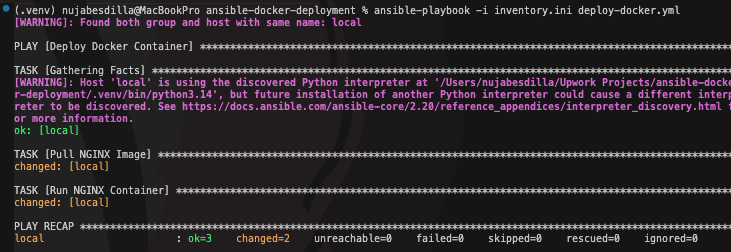
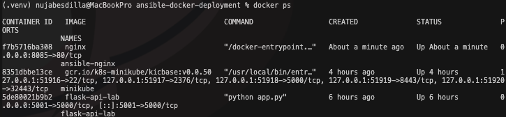
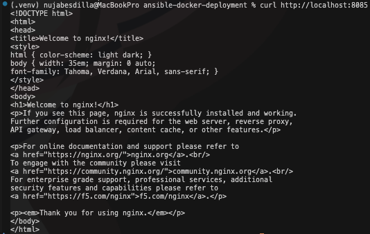
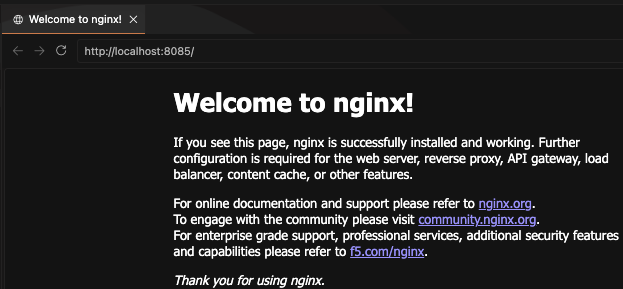
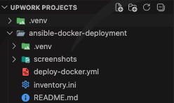

# Ansible Docker Deployment

## Overview

Automated Docker container deployment using Ansible playbooks. Pulled container images, deployed NGINX containers, and validated infrastructure automation workflows.

---

## Technologies

- Ansible
- Docker
- Linux
- YAML

---

## Architecture

```text
Ansible Playbook
      ↓
Docker Engine
      ↓
NGINX Container
```

---

## Commands Used

```bash
ansible-galaxy collection install community.docker

ansible-playbook -i inventory.ini deploy-docker.yml

docker ps

curl http://localhost:8085
```

---

## Screenshots

### Inventory File



### Playbook Configuration



### Playbook Execution



### Running Container



### Curl Validation



### Browser Validation



### Project Structure



---

## Key Outcomes

- Automated Docker deployment
- Used Ansible playbooks
- Managed containers through automation
- Validated infrastructure deployment
- Practiced configuration management